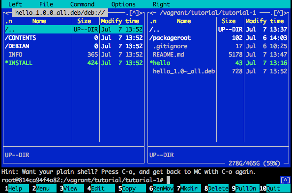

# Tutorial 1: building the simplest Debian binary package

So you are a Debian/Ubuntu user. You search for a package with `apt-cache search`. You install a package with `apt-get install`. You already intuitively know these:

 * Packages contain basic metadata such as names and descriptions.
 * Packages may have dependencies.
 * Packages contain files.

Indeed. A Debian package -- a .deb file -- is sort of like a tar.gz or zip file containing **metadata** and **files**. It's not actually a tar.gz or zip: the format is [ar](https://en.wikipedia.org/wiki/Ar_(Unix)) although that's not important.

Let's say you have a hello world application written in Python. It's only job is to print "hello 1.0.0":

~~~python
#!/usr/bin/env python
print("hello 1.0.0")
~~~

Let's build a simple package for this application, using as few tools and concepts as possible. This is not the proper way to build a package, but it helps you understand what a package is and how the basic process works. The fully proper way to build a package is quite complicated and involves many tools and concepts that build on top of each other.

**Table of contents**

 * [Creating the application](#creating-the-application)
 * [Creating the package root directory](#creating-the-package-root-directory)
   - [Control file fields](#control-file-fields)
 * [Turning the package root directory into a package](#turning-the-package-root-directory-into-a-package)
 * [Verifying that it works](#verifying-that-it-works)
 * [Inspecting the .deb file](#inspecting-the-deb-file)
 * [Conclusion](#conclusion)

---

## Creating the application

First, create a directory for this tutorial and place the above application in `hello`:

~~~bash
mkdir tutorial-1
cd tutorial-1
editor hello   # put the above source code in this file
chmod +x hello
~~~

## Creating the package root directory

Now that we have an application, let's build a package. The simplest application that builds a package is `dpkg-deb`. It accepts a directory containing package metadata files and content files. Let's create this directory. We call it `packageroot` but it can have any name.

~~~bash
mkdir packageroot
~~~

The package metadata must live in a file called `DEBIAN/control` under the package root directory. Let's create it:

~~~bash
mkdir packageroot/DEBIAN
editor packageroot/control
~~~

This is what `DEBIAN/control` should contain:

~~~
Package: hello
Version: 1.0.0-1
Architecture: all
Maintainer: John Doe <john@doe.com>
Depends: python
Description: John's hello package
 John's hello package is written in Python
 and prints a greeting.
 .
 It is awesome.
~~~

### Control file fields

These are the meanings of the fields:

 * "Package" specifies the package name.

 * "Version" specifies the package version number.

    Note that this consists of the application's own version number, followed by a dash, followed by a so-called *Debian package revision number*. The latter specifies the version number of the packaging work. Every time you modify the packaging work without modifying the application, you are supposed to bump this number but not the application's own version number. This is the first time we build a Debian package, so we specify "1".

    In tutorial 4 we will show you an example where you don't modify the application itself, and just modifies the packaging work.

 * "Architecture" specifies on which computer architectures this package is installable. Since Python apps themselves are platform-independent, we specify "all". But if we were packaging a C program, then this could also contain the name of a specific architecture such as "amd64" (Debian's name for x86_64) or "i386".

 * "Maintainer" specifies who maintains this package.

 * "Depends" is a comma-separated string that specifies this package's dependencies.

 * "Description" contains a summary on the first line, and a more verbose description on subsequent lines. The summary is what you see in `apt-cache search` while the more verbose description is what you see in APT GUIs such as the Ubuntu App Store or Aptitude.

   Note: the verbose description must be prefixed with a single space! And empty lines must contain a single dot character.

## Turning the package root directory into a package

Next, let's define the package contents. All files under the package root directory, except for `DEBIAN`, is considered part of the content. We want `hello` to be installed as `/usr/bin/hello`, so:

~~~bash
mkdir -p packageroot/usr/bin
cp hello packageroot/usr/bin/
~~~

Now that the package root directory is finished, we turn it into a .deb file:

~~~bash
dpkg-deb -b packageroot hello_1.0.0_all.deb
~~~

## Verifying that it works

Success! You can now install the .deb file and verify that it works:

~~~
$ sudo apt install -y ./hello_1.0.0_all.deb
$ hello
hello 1.0.0
~~~

## Inspecting the .deb file

Let's inspect the contents of the .deb file and compare it to the package root directory we made. The easiest way to do this is via Midnight Commander, a command-line based "GUI" file browser. Install and run it with:

~~~bash
sudo apt install mc
mc
~~~

Use the arrow keys and the Enter button to browse to the .deb file in question. Then hit Enter to display the contents of the .deb file. It will display a screen like so:

Under the DEBIAN/ subdirectory you will find our control file, while under the CONTENTS subdirectory you will find the files such as usr/bin/hello. Browse around. Use F3 to view a selected file, use F10 to exit Midnight Commander.

## Conclusion

A Debian package is an archive file that contains metadata (such as name, dependencies, description) and files. You have learned how to write a basic metadata specification file (the `control` file) and you have learned how this, combined with the actual files that you want the package to contain, can be turned into a .deb file using `dpkg-deb`. You have also learned how to inspect the insides of a .deb file

But as mentioned earlier, using `dpkg-deb` like this is not the *proper* way to make a package. In the next tutorial we will learn why, and what is a more proper (but still not fully proper) way.
